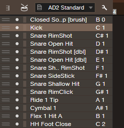

# AD2 Map for Studio One

Addictive Drums 2 Standard Mapping for Studio One

  

## How to use

1. Right click on the one you like, and download it!  
  a. **[AD2 Standard.pitchlist](https://github.com/nekonenene/AD2-Map-for-StudioOne/raw/master/AD2%20Standard.pitchlist)** (numerical order)  
  b. **[AD2 Standard reversed.pitchlist](https://github.com/nekonenene/AD2-Map-for-StudioOne/raw/master/AD2%20Standard%20reversed.pitchlist)** (piano-roll order)  
2. Drag & Drop to the keymap of Studio One's piano roll.
3. Save the preset.

## Q. Where's your sound?

A. Here.

* SoundCloud: https://soundcloud.com/nekonenene
* My Site: http://hato-neko.x0.com/music.html
